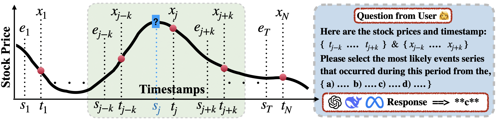

# Are you curious about the events behind the Time Series?

### "Inferring Event Descriptions from Time Series with Language Models" [Paper Link](https://arxiv.org/pdf/2503.14190).
## Dataset📖
We curate a dataset and propose our benchmark **"GAMETime: Generating And Modeling Events from TIME series"**. This dataset contains a **real-valued time series** of **1.7 million timestamps** along with corresponding **event sequences**.

## Setup 🔧
For our environment configuration and required additional packages, please refer to **"environment.yml"**.

## Run Experiments 💁🏼
./batch.sh (or ./slow.sh) is the shell built to submit tasks in **./script/**

Our main configuration files about LLMs and experiments are located in **"./tsllm/config/"**.

## How to setup prompts
run **./script/build.sh** and change the conditions in the shell script for different experiments 

And the prompts will be/have been saved in "./prompt/" 

## How to set up LLMs
The setup of different LLMs is in ./tsllm/models/

## How to use multi-gpus to run llama3.1 70B
It is very simple, I firstly build my prompts and they will be save in "prompts" 

and models running in different GPUs will go and draw task from "prompts".  details shown in "./tsllm/execute.py"
