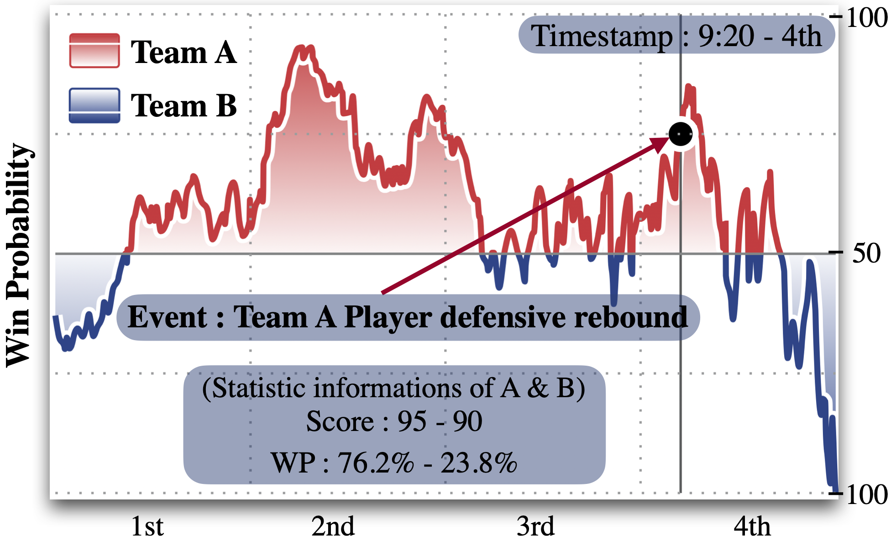

# Inferring Events from Time Series using Language Models


### [Paper Link](https://arxiv.org/pdf/2503.14190).

## Setup 🔧
For our environment configuration and required additional packages, please refer to **"environment.yml"**.

Our pipeline for GRPO training is built upon the [Open-r1](https://github.com/huggingface/open-r1) framework, for which we express our sincere appreciation. 
For details regarding the experimental environment setup, you might want ot refer to [Open-r1](https://github.com/huggingface/open-r1).

## 🚀🚀 Post-training Significantly Improves Event Inference

### Warm-up Stage: Knowledge Distillation

For models that initially **lack** any understanding or reasoning ability in the domain (e.g., sports)— such as Qwen2.5 1.5B — knowledge distillation is a **necessary prerequisite** before applying reinforcement learning. The input data is structured as follows:

```json
[
  {
    "key": "ORL_CLE_Apr 20, 2024.csv",
    "instruction": "You are an assistant for NBA basketball task. We will .....",
    "input": "Below is provided win probabilities  .... ",
    "process": "<think>\nAlright, let's try to figure out .... </think>\n**d**",
    "label": "d",
    "pred": "d"
  },
  ...
]
```
(The 'process' is distilled solution from DeepSeek-R1-Distill-Qwen-32B and 'instruction' is our question.) 

To start the warm-up stage (Slurm), use the following command:

```bash
sbatch warm-up/run.sh
```
### Reinforcement Learning: GRPO

After the warm-up, we apply GRPO (Generalized Reinforcement with Prompt Optimization), which enables further improvement through self-improvement. The input data consists of only Q&A pairs:

```json
[
  {
    "instruction": "You are an assistant for NBA basketball task. We will …..",
    "input": "Below is provided win probabilities …. ",
    "output": "c",
    "key": "DEN_OKC_Jan 31, 2024.csv7095"
  },
 ...
]
```
To start the GRPO (Slurm), use the following command:

```bash
sbatch scripts-sports-nba/nba-GRPO.sh
sbatch scripts-sports-nfl/nfl-GRPO.sh
```

### Results
Our two-stage post-training enables a 1.5B model without domain-specific reasoning ability to outperform its distillation source—and in some tasks, even solve OpenAI’s o1.


## Run Inferring 💁🏼
### Setup Prompts 
run **./script/build.sh** and change the conditions in the shell script for different experiments 
And the prompts will be/have been saved in **"./prompt/"**

### Events Inferring 
./batch.sh (or ./slow.sh) is the shell built to submit tasks in **./script/**
Our main configuration files about LLMs and experiments are located in **"./tsllm/config/"**.


## How to set up LLMs
The setup of different LLMs is in **./tsllm/models/**

## Dataset📖
We curate a dataset and propose our benchmark **"GAMETime: Generating And Modeling Events from TIME series"**. This dataset contains a **real-valued time series** of **1.7 million timestamps** along with corresponding **event sequences**.

## If you're interested in our Events-Times data 🛎️



Please email the author directly (e.g., `wtd3gz@virginia.edu`). To simplify the process, just send the following:
```bash
  "Hello, GAMETime."
  [Your Name]
```

We will provide you with a download link, **aiming to complete the process within a minute.**

Or you can find the script in the resource file to download the HTML and extract the data yourself.


